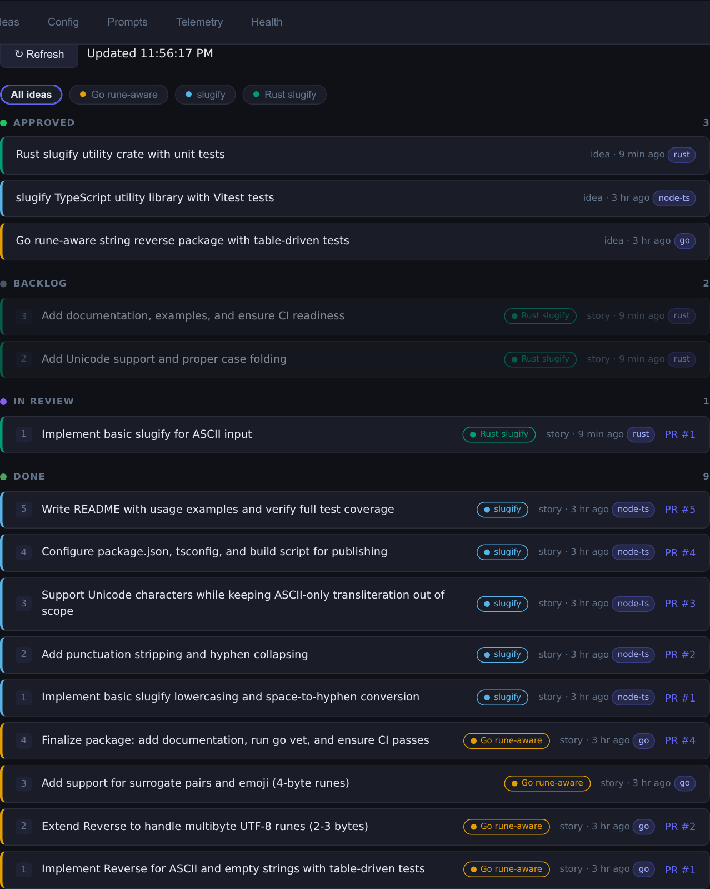
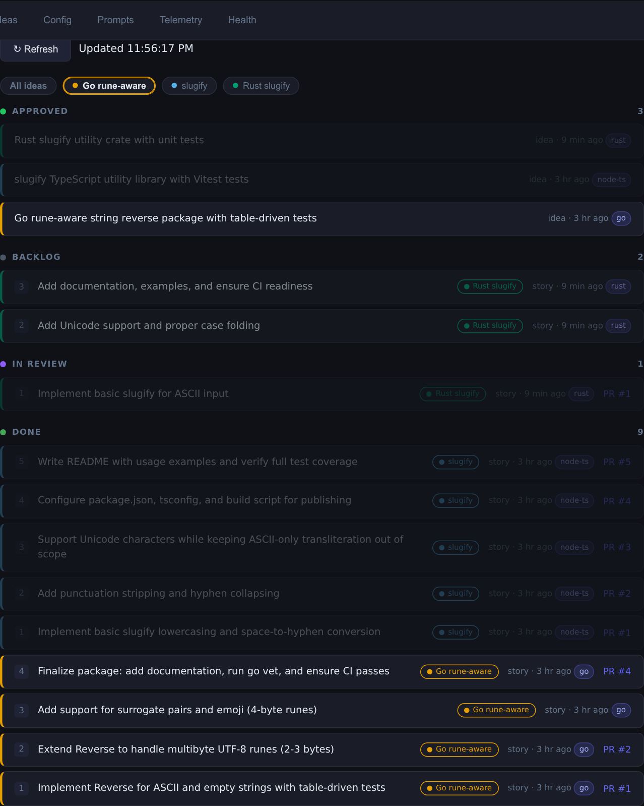
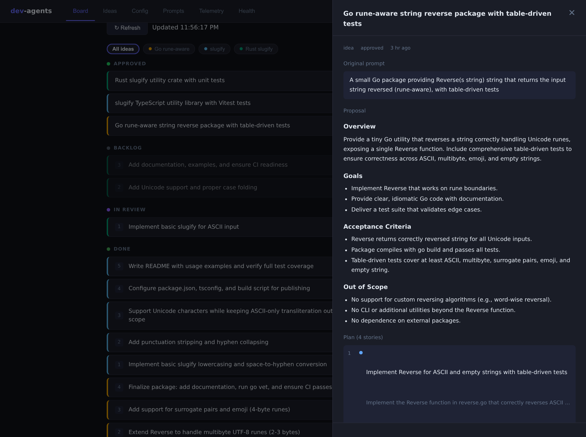
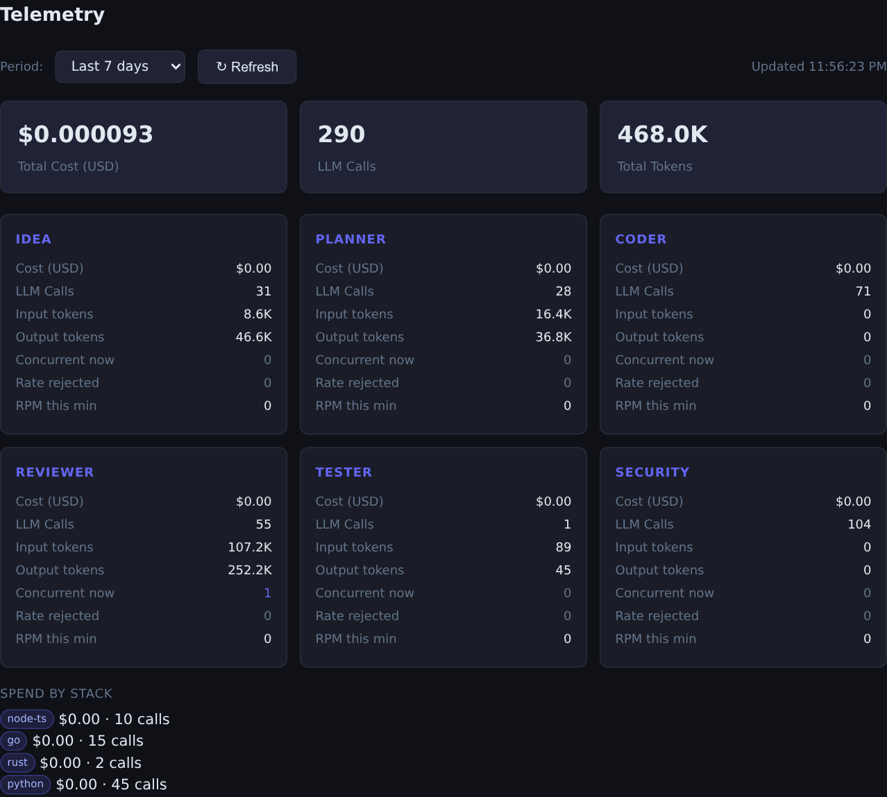
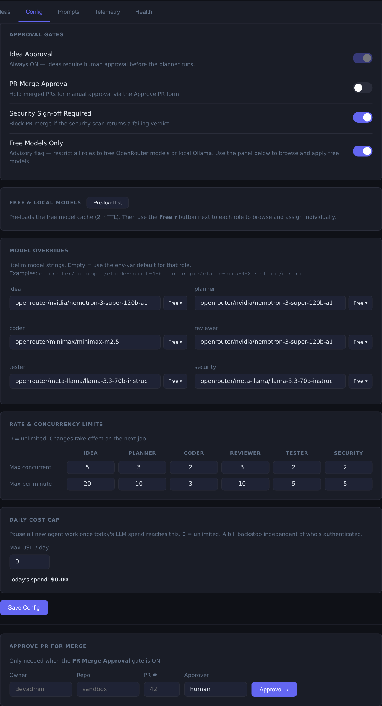

# Agentic Dev Team

A self-hosted autonomous coding team. You describe what to build and approve ideas; a pipeline of AI agents handles planning, coding, review, testing, and security checking end-to-end.

> ## ⚠️ Read this before you deploy
>
> **This is a single-user system.** The board (`http://<host>:8090`) is protected by a single shared **HTTP Basic Auth** login (`BOARD_AUTH_USER` / `BOARD_AUTH_PASSWORD`) — `setup.sh` generates the password on first run. **Leave the password blank and the board is wide open.**
>
> **Every idea you submit kicks off LLM calls across the whole pipeline (idea → planner → coder → reviewer + tester + security).** If the board is reachable by someone you don't trust — because auth is disabled, the password is weak, or the URL is on the public internet — **a stranger can run up your LLM bill,** exhaust your API quota, or get your provider account flagged. With a paid `ANTHROPIC_API_KEY` / `OPENROUTER_API_KEY`, that is real money.
>
> **The one rule that matters: don't expose `:8090` to the internet or an untrusted network.** This is meant to run on your laptop or a trusted home LAN, where keeping a `BOARD_AUTH_PASSWORD` set is enough. See [Security & access](#security--access).

## How it works

**Core principle:** The work board is the coordination backbone. Agents never talk to each other directly — they react to board and git events, claim work items, do their job, and post results back.

```
You submit an idea
  → Idea Agent expands it into a structured proposal (+ proposes a tech stack, SDLC style & code-style guides)
  → You approve it (confirm or override the stack, style & guides)
    → Planner Agent decomposes it into stories (per the SDLC style — e.g. TDD = tests-first)
      → Coding Agent implements each story, runs the stack's tests in its sandbox, opens a PR
        → Reviewer + Tester + Security agents evaluate the PR in parallel
          → All verdicts + CI green → PR merges → CI re-runs on main →
            pass → story done, next story starts   |   fail → back to a developer
```

**Stack-aware:** each project is tailored to a tech stack (Python, Node+TS, Go, …) and an
SDLC style (standard, TDD, spec-first) chosen at approval — driving the CI workflow,
scaffold, prompts, per-stack coder image, and per-stack cost telemetry. The catalog is
config-driven; adding a stack needs no code change. See **[docs/STACKS.md](docs/STACKS.md)**.

**Code-style guides:** you can also pick one or more code-style guides (e.g. Google
Python, Effective Go, Conventional Commits, or a "natural, human-sounding code" guide).
The Idea Agent proposes a fitting set; you confirm or override at approval; the guidance
is injected into the **coder** prompt (how it writes) and the **reviewer** prompt (what it
checks). Guides are multi-select and composable, and stack-scoped ones only appear for the
matching stack (Google Python won't show for a Go project).

> **Why "distilled" guides?** Each guide ships a *concise checklist* (the rules that
> matter), **not** the full document or a URL — the model can't fetch anything during a
> call, and dumping a 40k-token style guide into every coder/reviewer call would be
> redundant (the model already knows the famous public guides from training), dilute the
> signal, and — since this system runs largely on free models that don't support prompt
> caching — inflate the token cost of every call for no benefit. A focused checklist
> reinforces the specifics while keeping each call lean. (For a *proprietary* guide the
> model hasn't seen, full text + prompt caching would be the right tool — a possible
> opt-in extension, not the default.)

**Quality gates & resilience:**
- **Stack-appropriate CI** — Python enforces `ruff` (lint), `mypy` (types), `pytest`, and
  `pip-audit` (dependency vulnerability scan) on any imported dependencies.
- **In-coder TDD** — the coder runs the stack's tests in its sandbox and iterates to green
  *before* opening a PR, so fewer PRs arrive broken.
- **Merge-conflict recovery** — a story branched from a stale `main` is auto-rebased and its
  conflicts resolved, instead of stalling.
- **Post-merge CI gate** — `merged` is transient: CI runs on `main` after the merge; only on
  success does the story become `done` and the next story start. A failure returns it to a
  developer (with a capped automatic fix attempt).

## Screenshots

**The work board** — the coordination backbone. Every idea gets a stable, colorblind-safe
accent color; each story card carries its parent idea's stripe and name chip, so multiple
projects running at once stay legible. Status lanes (approved → backlog → in-review → done)
show sequence numbers, stack badges, verdict pips (R/T/S), relative timestamps, and PR links.



**Focus a single idea** — click a chip in the legend bar to spotlight one project and dim the
rest (the focus survives auto-refresh).



**Every item drills down** to its AI-generated proposal — overview, goals, acceptance
criteria, out-of-scope — and the planner's decomposition into ordered, independently
shippable stories.



**Cost telemetry** — spend, LLM calls, and token counts broken down per agent role and per
tech stack, plus live concurrency and rate-limit counters.



**Control panel** — toggle the approval gates, route each role to a different model (free
OpenRouter / local Ollama / paid), set per-role rate and concurrency limits, and cap daily
spend as a hard bill backstop.



## Agents

| Agent | Model | Trigger | Output |
|---|---|---|---|
| Idea | Claude / OpenRouter | Manual prompt | Structured proposal → `pending-approval` |
| Planner | Claude / OpenRouter | Idea approved | Stories with sequence, repo, description |
| Coder | opencode (any model) | Story `ready` | Branch + in-sandbox tests + PR → story `in-review` |
| Reviewer | Claude / OpenRouter | PR opened | Code review verdict (pass/warn/fail) |
| Tester | OpenRouter | PR opened | Test run verdict |
| Security | OpenRouter | PR opened | SAST + secret scan verdict |

A PR auto-merges only when all three verdicts and CI are green (plus any enabled human gate); the coder runs in a per-stack image, in an ephemeral sandbox with scoped credentials that cannot push to `main`.

## Human approval gates

| Gate | Default | Description |
|---|---|---|
| `idea_approval` | **ON** | You approve each idea before planning starts |
| `pr_merge_approval` | OFF | Optionally require a human to approve each PR merge |
| `security_signoff` | ON | Holds merge if security verdict is not green |

## Tech stack

| Component | Tool |
|---|---|
| Event bus + work board | Custom FastAPI service with SQLite + Redis |
| Git forge | Forgejo (self-hosted) |
| LLM routing | OpenRouter (free and paid models) or direct Anthropic API |
| Coding agent | opencode (model-agnostic, supports Ollama) |
| Agent isolation | Ephemeral Docker containers per coding run |

## Quick start

```bash
git clone https://github.com/yourname/agentic-dev-team
cd agentic-dev-team/infra
cp .env.example .env        # fill in API keys and secrets
./setup.sh                  # starts Forgejo + event-bus + Redis
./verify.sh                 # smoke-tests all APIs
```

Then open `http://localhost:8090` to access the board. Reach it from your machine or trusted LAN — just don't forward the port to the internet (see below).

## Security & access

This system is designed for a **single operator on a laptop or trusted home LAN** — running it "mostly unsecured" on your own network is the intended mode, not a compromise. The model is simple: **keep the board off untrusted networks, and keep a `BOARD_AUTH_PASSWORD` set.** Understand these properties:

- **The board uses one shared Basic Auth login.** Endpoints under `http://<host>:8090` — submitting ideas, approving/rejecting, approving PR merges, and changing runtime config (gate flags, model selection, rate limits) — require `BOARD_AUTH_USER` + `BOARD_AUTH_PASSWORD`. There is no per-user model; it's a single operator credential. **If `BOARD_AUTH_PASSWORD` is blank, auth is disabled and the board is fully open** (the event bus logs a `board_auth_disabled` warning at startup, and `verify.sh` flags it).
- **Weak/disabled auth = open wallet.** Submitting an idea triggers the full agent pipeline, and every stage is an LLM call. Anyone who gets in can submit ideas in a loop and **drive up your LLM bill, burn through your API quota, or get your provider account suspended.** Highest risk with a paid `ANTHROPIC_API_KEY` / `OPENROUTER_API_KEY`; even "free" OpenRouter models have rate limits an attacker can exhaust.
- **Agents act on your forge.** A submitted idea ultimately creates repos, branches, and PRs in Forgejo and merges them. Getting into the board hands that capability over.
- **Exempt endpoints.** `/health` (liveness), `/webhook/*` (authenticated by HMAC signature instead), and `/internal/*` (service-to-service on the container network) bypass Basic Auth by design — keep `:8090` off untrusted networks regardless.

**Do:**
- Set a **strong `BOARD_AUTH_PASSWORD`** (`setup.sh` generates one; don't blank it).
- Keep the board bound to `localhost` (default) or a private network segment you control.
- Set per-role **rate and concurrency limits** and a **daily cost cap** (`PATCH /api/config`) as a bill backstop, and prefer free/local models — defense-in-depth, not a substitute for the above.
- Keep `SANDBOX_MODE=docker` so coding agents run with scoped, least-privilege credentials that cannot push to `main`.

**Don't:**
- Don't blank `BOARD_AUTH_PASSWORD`, port-forward `:8090` on your router, bind it to `0.0.0.0` on an untrusted network, or share the URL/credentials with people you wouldn't hand your API key to.

**Do you need TLS/HTTPS?** For localhost or a trusted home LAN, **no** — and don't bother with a hand-rolled self-signed cert (browser warnings, `curl -k`, little benefit). `http://localhost` is already a browser-trusted secure context. TLS only matters if you reach the board from *outside* your trusted network, and the right tool there is a **VPN** (Tailscale/WireGuard) — it restricts access *and* encrypts, and Tailscale even issues a real, browser-trusted cert (`tailscale cert`). Reach for that instead of exposing the port; if you specifically want LAN HTTPS without warnings, **mkcert** installs a locally-trusted CA.

Forgejo has its own admin login (`FORGEJO_ADMIN_PASSWORD`); the reviewer/coder agents authenticate to it with scoped API tokens, not the admin password.

## Environment variables

```
ANTHROPIC_API_KEY           # for idea, planner, reviewer agents
OPENROUTER_API_KEY          # alternative/supplement to Anthropic
FORGEJO_API_TOKEN
FORGEJO_WEBHOOK_SECRET
BOARD_AUTH_USER=admin       # board login (HTTP Basic Auth)
BOARD_AUTH_PASSWORD         # board password — KEEP THIS SET (blank = board open)
SANDBOX_MODE=docker         # run coding agents in isolated containers (recommended)
```

See `infra/.env.example` for the full list.

## Story status flow

```
idea:   pending-approval → approved → rejected
story:  backlog → ready → in-progress → in-review → merged → done
                                      ↘ changes-requested → ready
```

`merged` is **transient** — after a PR merges, CI runs on `main`; on success the story
becomes `done` and the next sequenced story unlocks, on failure it returns to a developer
(`changes-requested`). A story the coder finds nothing to implement goes straight to `done`.

## Repository layout

```
agents/
  idea/       # Idea Agent (litellm + OpenRouter)
  planner/    # Planner Agent (litellm + OpenRouter)
  coding/     # Coding Agent (opencode subprocess)
  reviewer/   # Reviewer, Tester, Security agents + telemetry
event-bus/    # FastAPI webhook receiver, work item store, board UI, stack/SDLC catalog
infra/        # Docker Compose files, setup scripts, .env.example, per-stack coder images
docs/         # STACKS.md — the stack/SDLC catalog schema + how to add a stack
```
